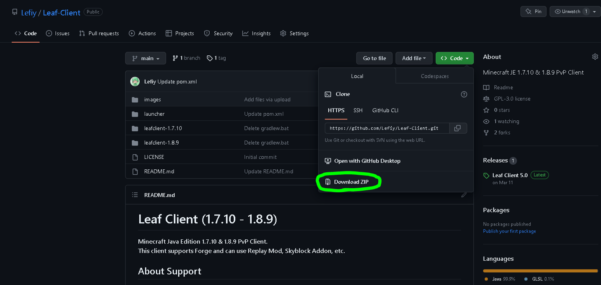
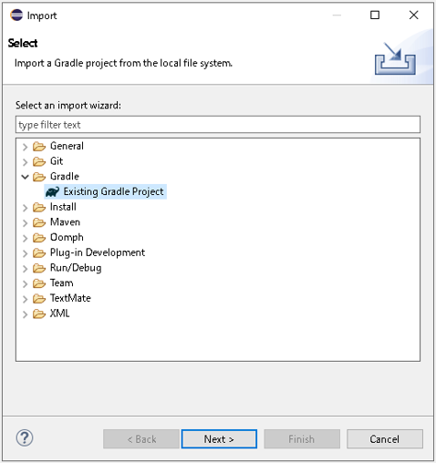
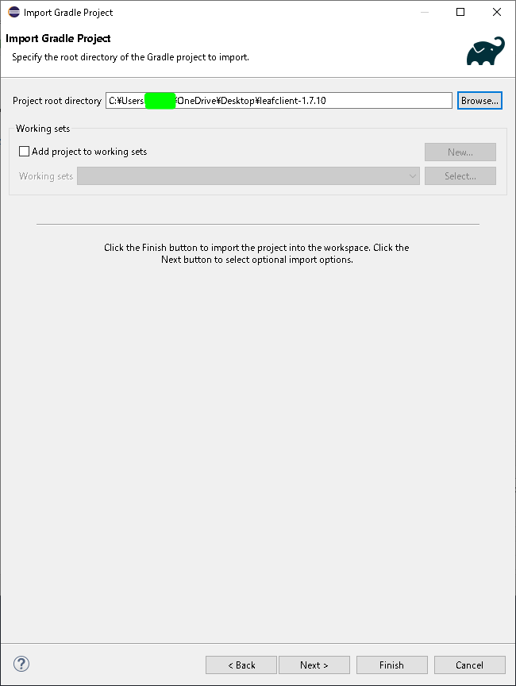
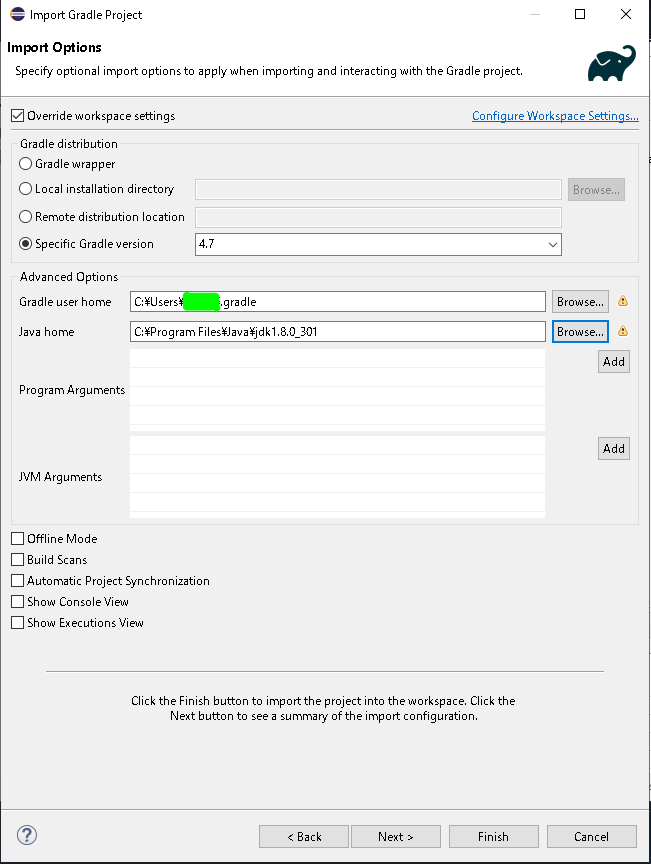
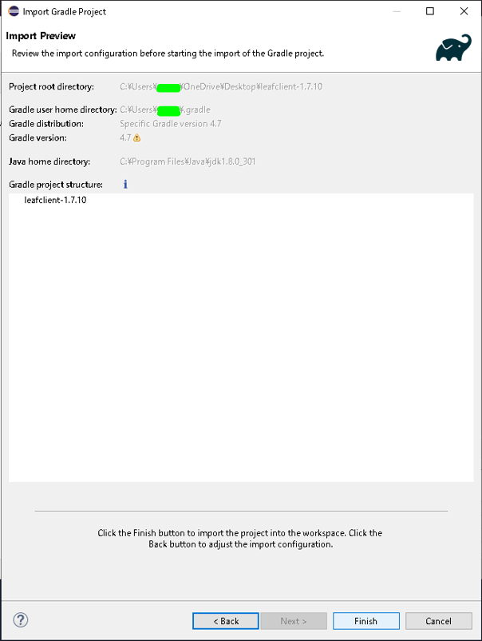
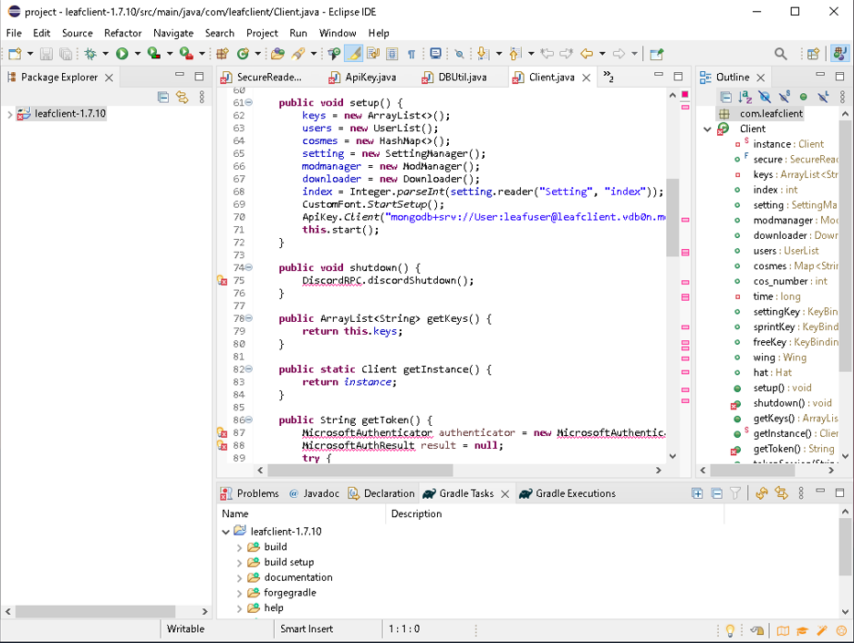
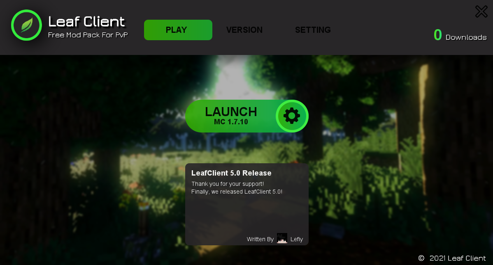

# Leaf Client (1.7.10 - 1.8.9)
**Minecraft Java Edition 1.7.10 &amp; 1.8.9 PvP Client.**  
**This client supports Forge and can use Replay Mod, Skyblock Addon, etc.**
## About Support
**Leaf Client is no longer under development.**  
**Therefore, the suggestion channel is closed.**  
**Only questions and bug reports are accepted.**  

> We do not provide support outside of the Discord.  
> Please do not ask questions on Github.  

Discord: https://discord.com/invite/eJtRwnhxdY
## About Development
### Libraries
The following libraries were used in the development.  

#### Client:

- Openauth: https://github.com/Litarvan/OpenAuth
- Discord RPC: https://github.com/Vatuu/discord-rpc
- Hypixel API: https://github.com/mdashlw/hypixel-api
- MongoDB Driver: https://github.com/mongodb/mongo-java-driver
- Spring Security: https://github.com/spring-projects/spring-security
- Jlayer: https://github.com/mahozad/jlayer
- Jackson: [Annotations](https://github.com/FasterXML/jackson-annotations), [Core](https://github.com/FasterXML/jackson-core), [Databind](https://github.com/FasterXML/jackson-databind)
- Okhttp: [Okio](https://github.com/square/okio), [Okhttp](https://github.com/square/okhttp)

#### Launcher:

- Apache Commons: [Commons-IO](https://github.com/apache/commons-io), [Commons-Codec](https://github.com/apache/commons-codec), [Commons-Logging](https://github.com/apache/commons-logging)
- Spring Security: https://github.com/spring-projects/spring-security
- Jackson: [Annotations](https://github.com/FasterXML/jackson-annotations), [Core](https://github.com/FasterXML/jackson-core), [Databind](https://github.com/FasterXML/jackson-databind)

### Used Code
The following code was used for development.  

- Font Renderer: [Quickdaffy's Font Renderer](https://www.youtube.com/watch?v=w0hHF2wMBB0&t=105s)

## About Design
The following sites were used to create the design.  

- Vecteezy: https://www.vecteezy.com/
- Pixlr: https://pixlr.com/

## How to build LeafClient

###Download LeafClient
Download the ZIP file and extract leafclient-1.7.10 or leafclient-1.8.9 from it.  

###Import Gradle Project
Create an empty project with Eclipse. I do not know about IntelliJ IDEA. Sorry :(  
Click "Import Project" and select gradle import.  

Set "Project Root Directory" like this.  
**AND CLICK "NEXT" DONT NOT CLICK "FINISH" !!**  

Set "Import Options" like this.  
Please use Java 8.  
Gradle 4.7 will probably work with 8.  
**AND CLICK "NEXT" DONT NOT CLICK "FINISH" !!**  

If you get to a screen like this, you are good to go :)  
Click "Finish".  

###Add Libraries
Perhaps this is how the error appears.  
This is because you have not added the library.  
Adding all of the above libraries will eliminate the error.  

## License

*GNU GENERAL PUBLIC LICENSE 3.0*

## Images

