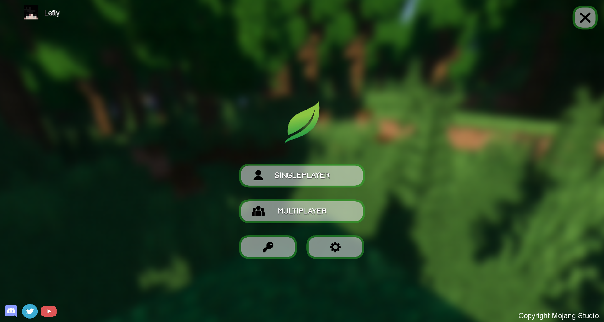
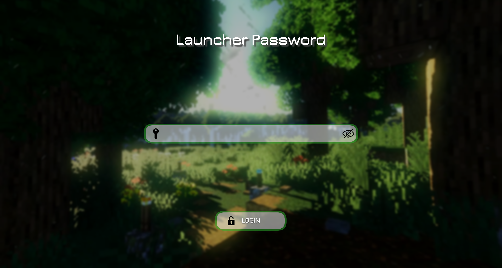
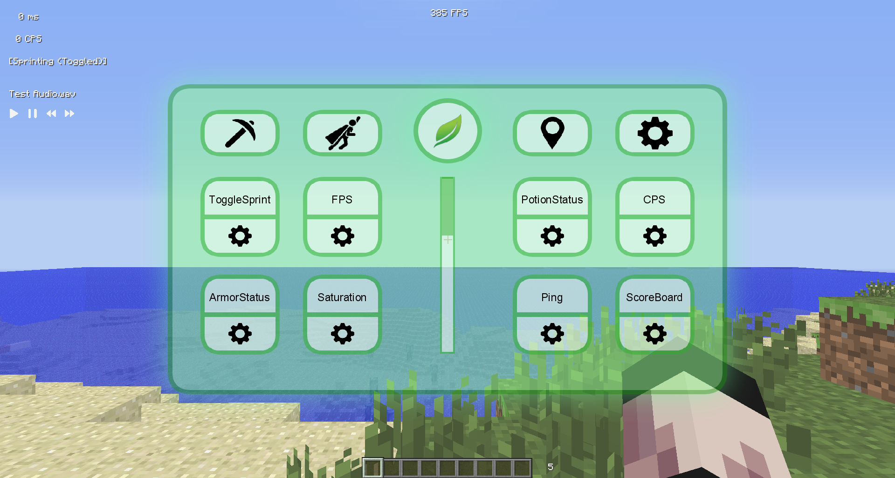
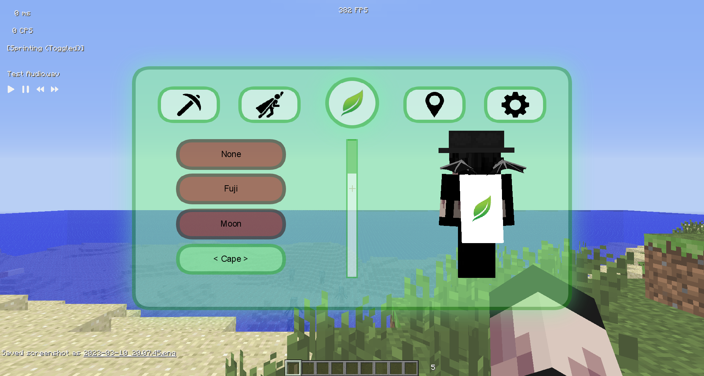
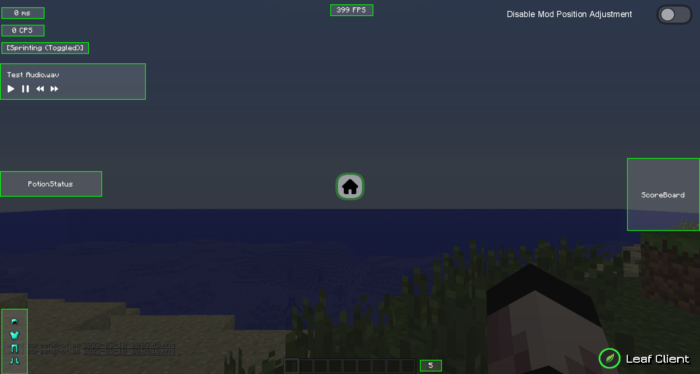
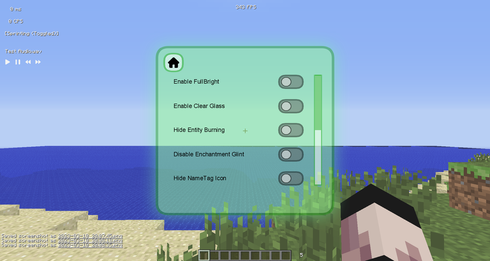

# Leaf Client (1.7.10 - 1.8.9)
**Minecraft Java Edition 1.7.10 &amp; 1.8.9 PvP Client.**  
**This client supports Forge and can use Replay Mod, Skyblock Addon, etc.**
## About Support
⚠ We do not provide support outside of the Discord.  
⚠ Please do not ask questions on Github.  

**Leaf Client is no longer under development.**  
**Therefore, the suggestion channel is closed.**  
**Only questions and bug reports are accepted.**  

Discord: https://discord.com/invite/eJtRwnhxdY
## Libraries
The following libraries were used in the development.

- Openauth: https://github.com/Litarvan/OpenAuth
- Discord RPC: https://github.com/Vatuu/discord-rpc
- Hypixel API: https://github.com/mdashlw/hypixel-api
- MongoDB Driver: https://github.com/mongodb/mongo-java-driver
- Jackson: [Annotations](https://github.com/FasterXML/jackson-annotations), [Core](https://github.com/FasterXML/jackson-core), [Databind](https://github.com/FasterXML/jackson-databind)
- Okhttp: [Okio](https://github.com/square/okio), [Okhttp](https://github.com/square/okhttp)
- Spring Security: https://github.com/spring-projects/spring-security
- Jlayer: https://github.com/mahozad/jlayer

## Images

